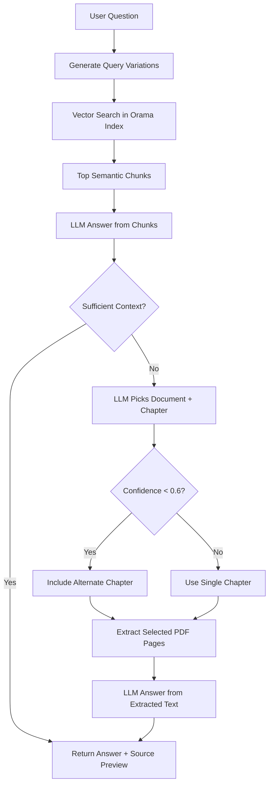

# Sanhita

Sanhita is a source-backed Nepali legal assistant built with SvelteKit.
It combines semantic retrieval, targeted PDF extraction, and LLM reasoning to answer legal questions with previewable evidence.

## What It Does

- Accepts natural-language legal questions in a chat interface.
- Runs semantic retrieval over a precomputed embeddings index.
- Tries to answer from top semantic passages first.
- Falls back to document-aware chapter selection when semantic context is insufficient.
- Extracts only selected PDF chapter pages (to reduce LLM context load).
- Shows inline source preview and expandable PDF preview modal.
- Stores multi-chat history in IndexedDB.
- Preloads model and search index asynchronously with startup status indicators.
- Supports automatic dark/light theme based on system preference.

## Tech Stack

- SvelteKit + Vite
- Groq SDK for LLM calls
- @xenova/transformers for local embedding generation
- @orama/orama for vector search
- pdfjs-dist for PDF page text extraction and rendering

## Project Structure

- `src/routes/+page.svelte`: main chat UI, startup loading status, conversation sidebar.
- `src/lib/pipeline.js`: query pipeline orchestration (semantic answer + fallback flow).
- `src/lib/search.js`: Orama DB initialization, lazy embeddings loading, vector search.
- `src/lib/embed.js`: embedding model warm-up and embedding generation.
- `src/lib/pdf.js`: PDF loading and selected page extraction.
- `src/lib/prompts.js`: LLM prompts for query expansion, answering, and document/chapter selection.
- `src/lib/static/index.json`: legal document/chapter metadata for fallback selection.
- `static/embeddings/manifest.json` + `static/embeddings/*.json`: chunked semantic search embeddings used at runtime.
- `data/embeddings.source.json`: original full embeddings source used to generate chunks.

## How Retrieval Works

At a high level, Sanhita uses a two-stage answer strategy.

1. Semantic-first path:
- Generate query variations.
- Search vector index and collect top chunks.
- Ask the LLM to answer only from retrieved chunks.

2. Fallback path (when semantic context is insufficient):
- Ask the LLM to pick the most likely document and chapter.
- If confidence is low, include one alternate chapter from the same document.
- Extract only selected pages from PDF.
- Ask the LLM to answer only from extracted text.



## Setup

### 1. Install dependencies

```bash
npm install
```

### 2. Configure environment

Create/update `.env` with:

```env
VITE_GROQ_API_KEY=your_groq_api_key
```

### 3. Start development server

```bash
npm run dev
```

### 4. Build for production

```bash
npm run build
npm run preview
```

## Notes

- The app currently runs client-side (`ssr = false`) and performs warm-up for model and source index after initial paint.
- Favicon and UI branding use the Sanhita orb visual identity.
- Large source loading is non-blocking so the interface is visible immediately.

## License

No license has been specified yet.
